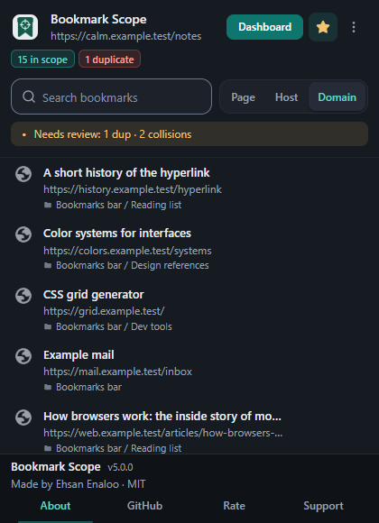
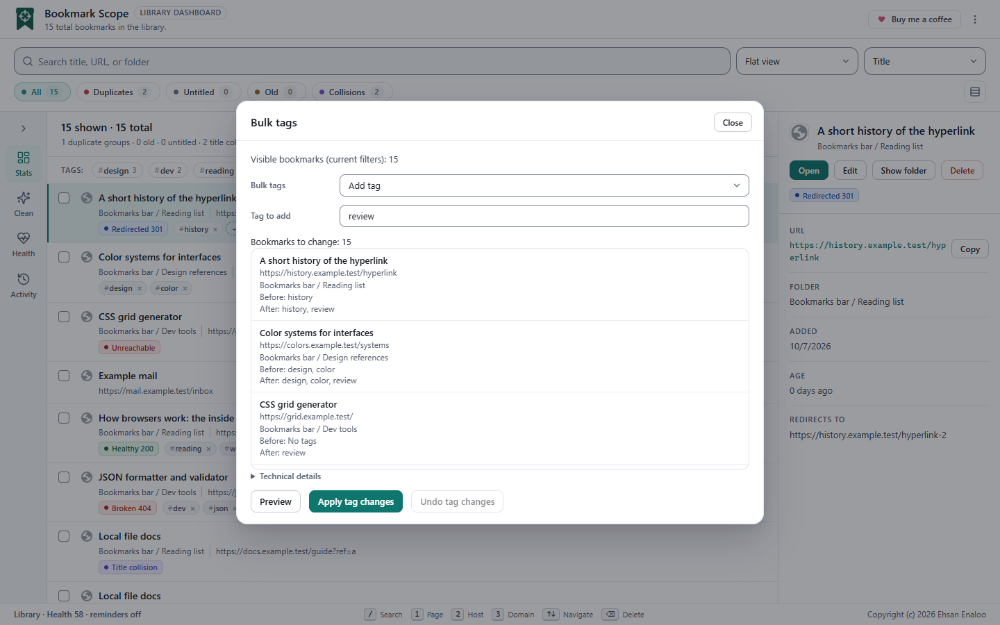
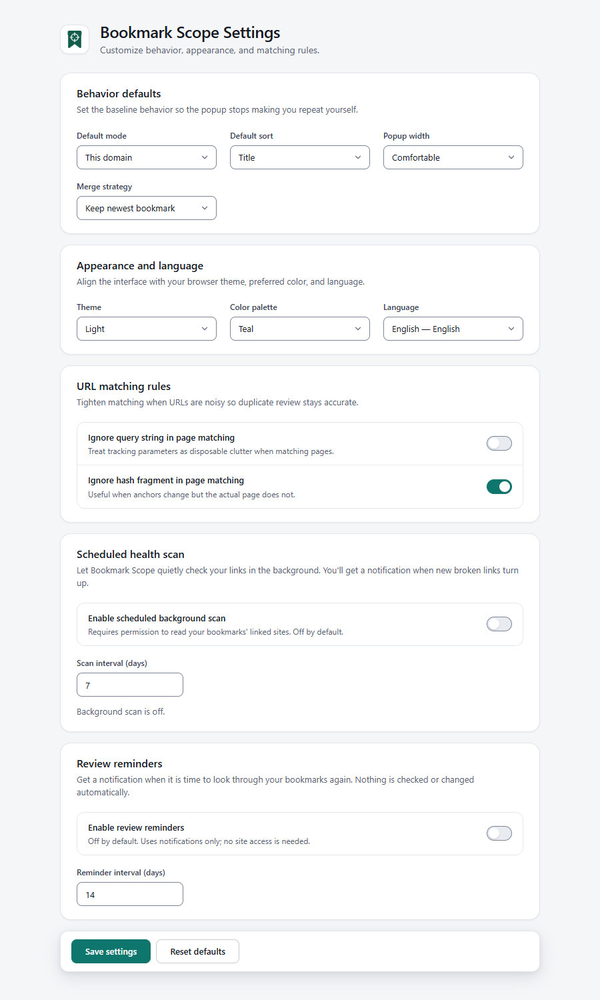
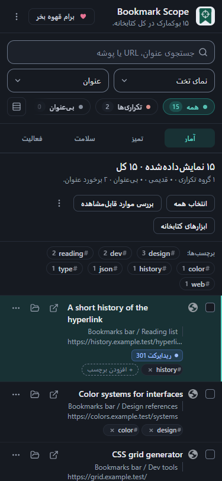

[English](README.md) · [فارسی](README.fa.md) · [Español](README.es.md) · [Français](README.fr.md) · [Deutsch](README.de.md) · [Português (Brasil)](README.pt-BR.md) · [Русский](README.ru.md) · [简体中文](README.zh-CN.md) · **日本語** · [العربية](README.ar.md) · [हिन्दी](README.hi.md)

<div align="center">


# Bookmark Scope

**いま見ているサイトのブックマークをすぐ探せます。残りのブックマークも整理できます。**

リンクを保存しすぎた人のための、無料の Chrome 拡張機能です。<br>
動作はあなたのパソコンの中だけです。アカウントも、トラッキングもありません。

[](https://chromewebstore.google.com/detail/cdonpinfefphkfdcffnangpmjjkoklfo)

[](LICENSE)


[](https://github.com/ehsanenaloo/Bookmark-Scope/stargazers)

</div>

<picture>
  <source media="(prefers-color-scheme: dark)" srcset="docs/assets/screenshots/dashboard-desktop-dark.png">
  
</picture>

## なぜ作ったのか

Chrome はブックマークをフォルダーのツリーで表示します。20 件ならこれで十分です。2,000 件になると困ります。

同じ記事を 3 回保存してしまいます。2019 年のフォルダーは、半分がリンク切れです。あるサイトのブックマークが 11 件あって、目的のものが見つかりません。Bookmark Scope は、こうした困りごとを助けます。

- どのページでもポップアップを開けます。そのページ、そのホスト、そのドメインについて、すでに持っているブックマークが分かります。
- ダッシュボードを開くと、ライブラリ全体を見られます。重複とリンク切れを見つけて、数回のクリックで直せます。

## できること

### このサイトについて保存済みのものを見る

ツールバーのアイコンをクリックします。ポップアップに、いま開いているページのブックマークが並びます。このページだけ、このホスト、ドメイン全体の 3 つを切り替えられます。アイコンのバッジには、一致したブックマークの数が出ます。

<p align="center">
  
  &nbsp;&nbsp;
  
</p>

### ライブラリ全体を見る

ダッシュボードは、ブックマーク用のフルページ画面です。タイトル、アドレス、フォルダーで検索できます。ドメインまたはフォルダーでグループ化できます。タイトル、アドレス、日付で並べ替えできます。重複、タイトルなし、古いブックマーク、タイトルの衝突で絞り込めます。数千件あっても動作は軽いままです。

ブックマークをクリックすると、詳細が見られます。複数にチェックを入れて、まとめて操作できます。ドラッグして順番を変えることもできます。

### 安心して整理する

大きな変更は、プレビューなしでは実行されません。

<p align="center">
  
</p>

- **重複。** 残すものを選びます。ほかのコピーのタグは、残すブックマークに追加されます。何かを削除する前に、結果を確認できます。
- **タグ。** 複数のブックマークに対して、タグの追加、削除、名前の変更、統合を一度に行えます。変更の前と後を確認してから適用します。元に戻すこともできます。
- **削除と元に戻す。** 削除したブックマークは、タグも含めて復元できます。ただし、Chrome はどの拡張機能にも、元の ID や追加日を戻すことを許可していません。そのため、復元されたブックマークは新しいものになります。拡張機能はこのことを表示してお知らせします。

<p align="center">
  
</p>

### リンク切れを見つける

ブックマークのグループをチェックして、どのリンクが開けるか、どれがリダイレクトされるか、どれが壊れているかを調べます。チェックはブラウザー内で動き、通信先はブックマークしたサイトだけです。

- 最初に許可を求めます。許可しなくても、ほかの機能はすべて使えます。
- 長いスキャンは一時停止できます。あとで続きから再開できます。
- 定期スキャンを有効にできます。初期設定ではオフです。
- 「Repair redirected」は、新しいアドレスに移ったブックマークを更新します。元に戻す機能はないので、先に新しいアドレスを確認してください。

### バックアップと移行

- **スナップショット。** フォルダーとタグを含むライブラリ全体を、1 つのファイルに保存します。あとで、新しいフォルダーに復元できます。
- **インポート。** Chrome、Edge、Firefox、Safari、Brave のブックマーク(`bookmarks.html` ファイル)、Pocket、Pinboard、Raindrop.io、または CSV、JSON、リンクだけのテキストから取り込めます。プレビューが表示されます。重複の扱いは、残す、スキップ、統合から選べます。
- **エクスポート。** いま表示しているブックマークを、JSON または CSV で保存します。

<p align="center">
  
</p>

### すばやく操作する

- **コマンドパレット。** `Ctrl+Shift+P`(Mac では `Cmd+Shift+P`)を押して、やりたいことを入力します。
- **保存したビュー。** 検索を、フィルター、タグ、並び順、グループ化と一緒に保存できます。ワンクリックでまた開けます。
- **右クリックメニュー。** どのページやリンクでも、そのドメインのブックマークを表示したり、そのリンクの重複を探したりできます。
- **見直しのリマインダー。** 数週間に一度、整理を促してほしいときは、設定でオンにします。

<p align="center">
  
</p>

### 自分好みにする

ライト、ダーク、システムのテーマがあります。配色は 4 種類です。右から左へ書く言語のレイアウトにも対応しています。拡張機能には 52 の言語が入っています([注意点](#good-to-know)を参照)。

<p align="center">
  
  &nbsp;&nbsp;
  
</p>

## インストール

**Chrome Web Store から(いちばん簡単)**

1. [Bookmark Scope のページ](https://chromewebstore.google.com/detail/cdonpinfefphkfdcffnangpmjjkoklfo)を開きます。
2. **Add to Chrome** をクリックします。
3. ツールバーのパズルのアイコンをクリックして、Bookmark Scope をピン留めします。

Edge や Brave など、ほかの Chromium ブラウザーでも、たいてい同じページからインストールできます。私が動作を確認しているのは Chrome だけです。Firefox と Safari には対応していません。

**このリポジトリから**

ビルドの手順はありません。このフォルダーがそのまま拡張機能です。

1. このリポジトリをダウンロードするか、クローンします。
2. `chrome://extensions` を開いて、**デベロッパー モード**をオンにします。
3. **パッケージ化されていない拡張機能を読み込む**をクリックして、`manifest.json` が入っているフォルダーを選びます。

パッケージ化されていないコピーには、専用の拡張機能 ID が付きます。Store 版と並べて入れておけますが、両者はデータを共有しません。また、パッケージ化されていないコピーは自動では更新されません。

## データは手元に残ります

サーバーはありません。アカウントも、アナリティクスも、広告もありません。ブックマーク、タグ、設定は、あなたのブラウザーの中に残ります。詳しくは[プライバシーポリシー](PRIVACY.md)をご覧ください。

拡張機能は、開いているページの内容を読みません。読むのは、現在のタブのアドレスだけです。これは、一致するブックマークを表示するためです。

| 権限 | 用途 |
| --- | --- |
| `bookmarks` | ブックマークを読み取ります。あなたが操作したときは、変更もします |
| `tabs` | ポップアップとバッジのために、現在のタブのアドレスを読み取ります |
| `storage` | 設定、タグ、スキャン結果をブラウザーに保存します |
| `alarms` | 任意のリマインダーと、任意の定期スキャンを実行します |
| `notifications` | リマインダーとスキャン結果を表示します |
| `contextMenus` | 右クリックメニューの項目を追加します |
| `clipboardWrite` | コピーボタンをクリックしたときに、アドレスをコピーします |
| `favicon` | ブラウザー自身のキャッシュから、サイトのアイコンを表示します |
| ウェブサイト(任意) | リンクチェックを開始したときだけ許可を求めます。ブックマークしたサイトに接続するために使います |

<a id="good-to-know"></a>

## 注意点

- **翻訳。** 翻訳は、AI の助けと自動チェックを使って直しました。人が読んで確認したのは、英語とペルシア語だけです。ほかの言語には、間違いや、英語の単語が残っている部分があるかもしれません。見つけたら、[issue を作成](../../issues)するか、プルリクエストを送ってください。[CONTRIBUTING.md](CONTRIBUTING.md#translations)を参照してください。
- **この日本語版について。** この README の日本語は、AI の助けを借りて書きました。日本語を母語とする人には、まだ読んでもらっていません。不自然な表現や間違いがあれば、issue かプルリクエストで教えてください。
- **インポートはフラットです。** `bookmarks.html` ファイルをインポートすると、フォルダー名はパスとして表示されます。ただし、フォルダーは作られず、元の日付も残りません。フォルダーのツリーを作り直したいときは、スナップショットを使ってください。
- **リンクチェックは目安です。** 4xx の応答はすべて「壊れている」と数えます。ページは開くけれどエラーやログイン画面が出る場合は、「正常」と数えます。
- **CSV。** CSV のエクスポートは、インポート機能と、実際の Chrome でのダウンロードで確認しました。Excel、Numbers、Google スプレッドシートではまだ開いていません。
- **テスト。** 拡張機能は Chromium でテストしています。[制限事項の一覧](docs/guides/limits.html)をご覧ください。

## キーボードショートカット

| キー | 動作 |
| --- | --- |
| `Ctrl+Shift+P` / `Cmd+Shift+P` | コマンドパレットを開きます |
| `/` | 検索ボックスに移動します |
| `Ctrl+A` / `Cmd+A` | 現在の一覧のブックマークをすべて選択します |
| `Esc` | 1 つ前の状態に戻ります。編集のキャンセル、検索のクリア、選択の解除、ダイアログを閉じる、のいずれかです |

## ユーザーガイド

ガイドでは、拡張機能のすべての部分を、スクリーンショット付きで説明しています。まず [docs/README.md](docs/README.md) を読むか、[guides フォルダー](docs/guides/)を開いてください。ウェブページとして読むには、ブラウザーで `docs/index.html` を開きます。

## プロジェクトに協力する

バグ報告、翻訳の修正、小さなプルリクエストを歓迎します。まず [CONTRIBUTING.md](CONTRIBUTING.md) を読んでください。プルリクエストを送る前に、次のチェックを実行してください。Node.js 24 以降が必要です。インストールの手順はありません。

```bash
node scripts/validate.mjs
node scripts/test.mjs
```

セキュリティの問題は、非公開で報告してください。[SECURITY.md](SECURITY.md) を参照してください。

Bookmark Scope が時間の節約になったなら、[コーヒーをおごる](https://buymeacoffee.com/enaloo)こともできます。[Chrome Web Store](https://chromewebstore.google.com/detail/cdonpinfefphkfdcffnangpmjjkoklfo) での評価も、ほかの人が見つける助けになります。

## コントリビューター

このプロジェクトを助けてくれたすべての方に感謝します。最初の貢献が取り込まれると、ここにお名前が表示されます。詳しくは [CONTRIBUTING.md](CONTRIBUTING.md#recognition) をご覧ください。

<a href="https://github.com/ehsanenaloo/Bookmark-Scope/graphs/contributors"></a>


## ライセンス

[MIT](LICENSE)。Copyright 2026 Ehsan Enaloo.

2 つの部分は、ほかのプロジェクトのものです。それぞれのライセンスのまま使っています。詳細は [THIRD_PARTY_NOTICES.md](THIRD_PARTY_NOTICES.md) にあります。Public Suffix List(MPL-2.0)と、[Lucide](https://lucide.dev) のアイコン(ISC)です。
