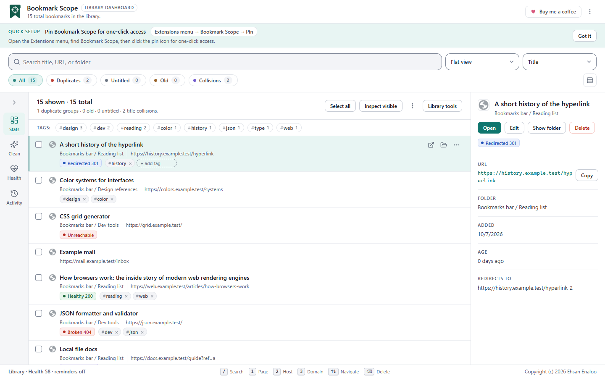
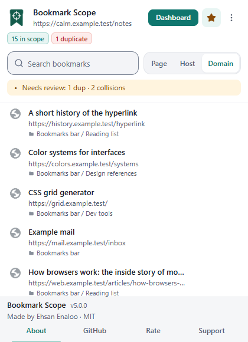
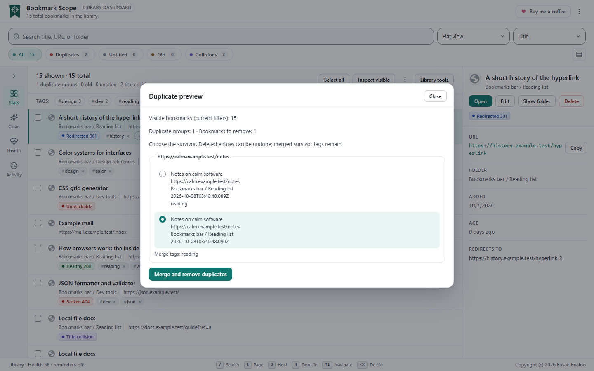
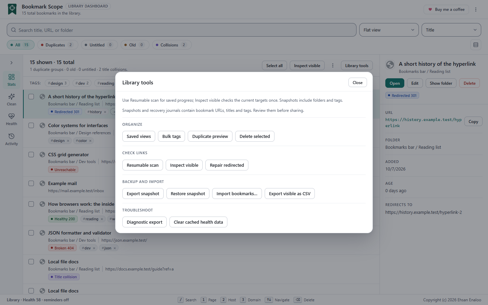
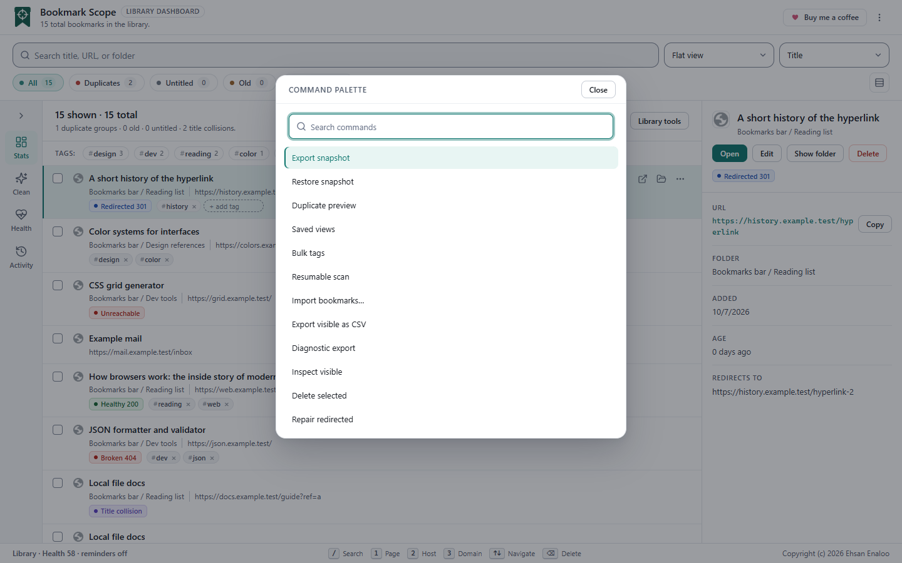

[English](../../README.md) · [فارسی](README.fa.md) · [Español](README.es.md) · **Français** · [Deutsch](README.de.md) · [Português (Brasil)](README.pt-BR.md) · [Русский](README.ru.md) · [简体中文](README.zh-CN.md) · [日本語](README.ja.md) · [العربية](README.ar.md) · [हिन्दी](README.hi.md)

# Bookmark Scope

**Retrouvez les marque-pages du site sur lequel vous êtes. Faites le ménage dans le reste de votre bibliothèque.**

Une extension de navigateur gratuite et open source pour les personnes qui ont enregistré trop de liens. 
Elle fonctionne uniquement sur votre ordinateur. Pas de compte, pas de suivi.

[Fonctionnalités](#features) · [Installation](#install) · [Confidentialité](#privacy) · [Documentation](#documentation) · [FAQ](#faq) · [Contribuer](#contributing)

<picture>
  <source media="(prefers-color-scheme: dark)" srcset="../assets/screenshots/dashboard-desktop-dark.png">
  
</picture>

## Qu'est-ce que Bookmark Scope ?

Chrome affiche vos marque-pages sous forme d'arborescence de dossiers. Ça marche pour vingt liens, pas pour deux mille. Vous enregistrez trois fois le même article, la moitié d'un vieux dossier ne contient que des liens morts, et vous ne savez pas ce que vous avez déjà enregistré pour le site que vous lisez.

Bookmark Scope règle ce problème avec deux outils. La **fenêtre contextuelle** montre les marque-pages que vous avez déjà pour la page, le site ou le domaine où vous êtes. Le **tableau de bord** montre toute votre bibliothèque. Vous y trouvez les doublons et les liens morts, et vous faites le ménage en quelques clics, avec un aperçu avant tout changement.

## Fonctionnalités

| | |
| --- | --- |
| **Fenêtre pour le site actuel**   Voyez vos marque-pages enregistrés pour cette page, cet hôte ou ce domaine. Le badge de la barre d'outils indique combien correspondent. | **Tableau de bord pour toute la bibliothèque**   Cherchez, filtrez, regroupez, triez, étiquetez et modifiez des milliers de marque-pages. Il reste rapide. |
| **Ménage sans risque**   Prévisualisez d'abord la fusion des doublons et les changements d'étiquettes en lot. Annulez ce que vous supprimez, étiquettes comprises. | **Vérification des liens morts**   Trouvez les liens cassés et redirigés. Elle est facultative, et les longues analyses peuvent être mises en pause puis reprises. |
| **Sauvegarde et import**   Enregistrez des instantanés de votre bibliothèque. Importez depuis `bookmarks.html`, Pocket, Pinboard, Raindrop.io, CSV et JSON. Exportez en JSON ou en CSV. | **Vues enregistrées et palette de commandes**   Rouvrez une recherche enregistrée en un clic. Appuyez sur `Ctrl+Shift+P` (`Cmd+Shift+P` sur Mac) pour accéder à toutes les actions. |
| **Privé par conception**   Pas de serveur, pas de compte, pas d'analytique. Vos données restent dans votre navigateur. | **Votre langue et votre style**   52 langues, thèmes clair et sombre, quatre palettes de couleurs, mises en page de droite à gauche. |

  
  &nbsp;&nbsp;
  

  
  &nbsp;&nbsp;
  

## Installation

| Navigateur | État | Comment |
| --- | --- | --- |
| **Chrome** | Testé | [Chrome Web Store](https://chromewebstore.google.com/detail/cdonpinfefphkfdcffnangpmjjkoklfo) |
| **Edge** | Fonctionne | [Microsoft Edge Add-ons](https://microsoftedge.microsoft.com/addons/detail/ioonncgajlliiajlebblkfkgagcgcnae) |
| **Brave** | Fonctionne | Installez depuis la même page du Chrome Web Store. |
| **Firefox 140+** (ordinateur) | Expérimental | [Installation temporaire depuis la page des Releases](#firefox-experimental) |
| **Safari** | Non pris en charge | |

**Chrome et Brave :** ouvrez la page de la boutique, cliquez sur **Add to Chrome**, puis cliquez sur l'icône en forme de pièce de puzzle dans la barre d'outils et épinglez Bookmark Scope.

**Edge :** ouvrez la [page sur Microsoft Edge Add-ons](https://microsoftedge.microsoft.com/addons/detail/ioonncgajlliiajlebblkfkgagcgcnae) et cliquez sur **Get**.

**Firefox (expérimental) :** l'extension n'est pas encore sur Firefox Add-ons.

1. Téléchargez `bookmark-scope-<version>-firefox.zip` depuis la [page des Releases](https://github.com/ehsanenaloo/Bookmark-Scope/releases).
2. Dans Firefox, ouvrez `about:debugging#/runtime/this-firefox`.
3. Cliquez sur **Load Temporary Add-on** et choisissez le fichier zip.

Firefox supprime les modules complémentaires temporaires quand il se ferme. Plus de détails dans le [guide d'installation](https://enaloo.com/apps/bookmark-scope/docs/installation/#firefox-experimental).

**Depuis les sources :** il n'y a pas d'étape de compilation. Le dossier `extension/` est l'extension. Ouvrez `chrome://extensions`, activez le **Mode développeur**, cliquez sur **Charger l'extension non empaquetée** et choisissez le dossier `extension`.

## Confidentialité

- Il n'y a ni serveur, ni compte, ni analytique, ni publicité.
- Vos marque-pages, vos étiquettes et vos réglages restent dans votre navigateur.
- Les seules requêtes réseau sont les vérifications de liens vers les sites que vous avez enregistrés, et seulement après votre autorisation. Tout le reste fonctionne sans cette autorisation.
- L'extension ne lit pas les pages que vous visitez. Elle lit seulement l'adresse de l'onglet actif, pour afficher les marque-pages correspondants.

Lisez la [politique de confidentialité](https://enaloo.com/apps/bookmark-scope/docs/privacy-policy/) pour les détails et la liste des autorisations.

## Documentation

| | |
| --- | --- |
| [Guide d'utilisation](https://enaloo.com/apps/bookmark-scope/) | Toutes les fonctionnalités, avec des captures d'écran |
| [Limites connues](https://enaloo.com/apps/bookmark-scope/docs/limits/) | Ce qui est inachevé ou non testé |
| [Politique de confidentialité](https://enaloo.com/apps/bookmark-scope/docs/privacy-policy/) | Ce que l'extension stocke et envoie |
| [Journal des modifications](../../CHANGELOG.md) | Ce qui a changé à chaque version |
| [Contribuer](../../.github/CONTRIBUTING.md) | Comment signaler des bugs et proposer des changements |
| [Sécurité](../../.github/SECURITY.md) | Comment signaler un problème de sécurité en privé |

## FAQ

<b>Envoie-t-elle mes marque-pages quelque part ?</b>

Non. Il n'y a pas de serveur. Vos marque-pages restent dans votre navigateur. L'extension contacte seulement les sites que vous avez enregistrés, quand vous lancez une vérification de liens et que vous l'avez autorisée.

<b>Modifie-t-elle ou supprime-t-elle des marque-pages toute seule ?</b>

Non. Elle ne change vos marque-pages que lorsque vous le demandez. Les fusions et les changements d'étiquettes en lot montrent d'abord un aperçu, et les suppressions demandent une confirmation.

<b>Puis-je récupérer un marque-page supprimé ?</b>

Oui, utilisez Annuler. Le marque-page revient dans son dossier avec ses étiquettes. Les navigateurs ne permettent à aucune extension de rétablir l'identifiant d'origine ni la date d'ajout, donc le marque-page restauré est un nouveau marque-page.

<b>Fonctionne-t-elle avec d'autres gestionnaires de marque-pages ?</b>

Vous pouvez importer depuis Chrome, Edge, Firefox, Safari et Brave (le fichier `bookmarks.html`), Pocket, Pinboard, Raindrop.io, ainsi que des fichiers CSV et JSON. Les imports sont à plat : les dossiers apparaissent sous forme de chemin, mais ne sont pas créés.

<b>Comment signaler un problème ou demander une fonctionnalité ?</b>

[Ouvrez une issue](https://github.com/ehsanenaloo/Bookmark-Scope/issues). Merci de ne pas joindre votre vraie liste de marque-pages. Pour les problèmes de sécurité, consultez [SECURITY.md](../../.github/SECURITY.md).

## Traductions

Les traductions sont automatiques : elles peuvent contenir des erreurs ou laisser quelques mots en anglais. Si l'une de ces langues est votre langue maternelle et que vous pouvez écrire une traduction correcte et naturelle, aidez-nous : [ouvrez une issue](https://github.com/ehsanenaloo/Bookmark-Scope/issues) ou envoyez une pull request. Détails dans [CONTRIBUTING.md](../../.github/CONTRIBUTING.md#translations).

## Contribuer

Les rapports de bugs, les corrections de traduction et les petites pull requests sont les bienvenus. Lisez d'abord [CONTRIBUTING.md](../../.github/CONTRIBUTING.md).

Si Bookmark Scope vous fait gagner du temps, vous pouvez [m'offrir un café](https://buymeacoffee.com/enaloo). Une note sur le [Chrome Web Store](https://chromewebstore.google.com/detail/cdonpinfefphkfdcffnangpmjjkoklfo) aide aussi d'autres personnes à le trouver.

### Contributeurs

Merci à toutes les personnes qui ont aidé. Votre nom apparaît ici après votre première contribution acceptée.

## Licence

[MIT](../../LICENSE). Copyright 2026 Ehsan Enaloo.

Le code de l'extension est sous licence MIT. Deux éléments viennent d'autres projets et gardent leurs propres licences : la Public Suffix List (une liste de fins de domaine comme `.co.uk`, MPL-2.0) et les icônes [Lucide](https://lucide.dev) (ISC). Les textes complets se trouvent dans [extension/THIRD_PARTY_NOTICES.md](../../extension/THIRD_PARTY_NOTICES.md).
